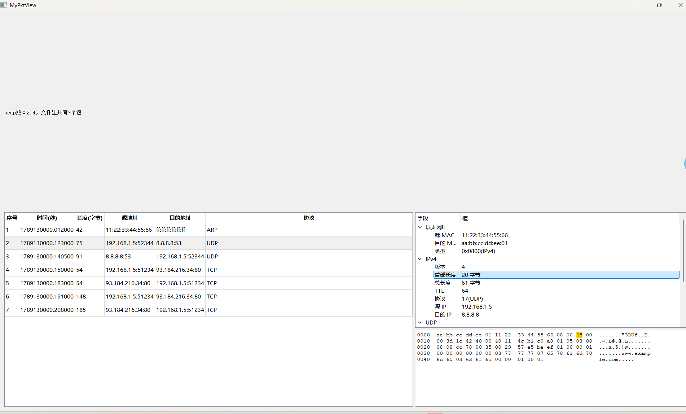

# pcap-analyzer —— 基于 Qt 的 pcap 抓包分析工具

用 C++ / Qt 从零实现的一个抓包文件分析工具：读入 `.pcap` 文件，把每个数据包列成表格，
点某一行就能看到它的**协议分层结构**和**原始字节**，点树上的任意字段还能把对应的字节高亮出来。

> 仓库名是 `pcap-analyzer`，工程文件仍是 `NPC.pro`，编译出来的程序是 `NPC.exe`。
> 整个项目没有依赖任何抓包库（libpcap 等），pcap 文件格式和协议解析都是自己写的。

📄 **原理说明**：[pcap 文件格式详解（字节布局 → 逐层解析）](docs/pcap-format.md) ｜ 同步发布于 [CSDN](https://blog.csdn.net/kamenrider___/article/details/166494218)

## 功能

**pcap 文件解析**
- 自动判断文件字节序（用开头的魔数 `d4 c3` / `a1 b2` 区分小端/大端）
- 读取 pcap 版本号、遍历文件中所有数据包（记录头 → 包数据）

**数据包列表**（主界面左侧表格）
- 序号 / 时间戳（秒，保留 6 位小数）/ 长度 / 源地址 / 目的地址 / 协议
- 地址带上端口：`192.168.1.5:52344 → 8.8.8.8:53`

**协议分层解析**（点击表格某一行，右侧显示）

| 层 | 解析内容 |
|---|---|
| 以太网 II | 目的 MAC、源 MAC、类型（IPv4 / ARP / 其他） |
| IPv4 | 版本、首部长度（IHL）、总长度、TTL、协议号、源 IP、目的 IP |
| TCP | 源/目的端口、序号、标志位（FIN/SYN/RST/PSH/ACK/URG）、窗口大小 |
| UDP | 源/目的端口 |
| ICMP / ARP | 识别并显示协议类型 |
| **DNS**（UDP 53） | 事务 ID、标志（查询/响应）、问题数、回答数、查询名、回答记录（A 记录 IP、别名、TTL） |

**十六进制视图**（右下角）
- 偏移 + 16 字节十六进制 + ASCII 三栏显示（Wireshark 风格）

**字段联动高亮**
- 点击协议树上的任意字段，下方十六进制视图中**对应的字节变黄**

## 界面截图



## 编译运行

**环境**：Qt 5.8.0 + MinGW 5.3 (32-bit)

**方式一：Qt Creator**
1. 打开 `NPC.pro`
2. 套件选 `Desktop Qt 5.8.0 MinGW 32bit`
3. Ctrl+R 运行

**方式二：命令行**
```bash
qmake NPC.pro "CONFIG+=release" "CONFIG-=debug_and_release"
mingw32-make -j4
```

**样例文件**：`samples/sample.pcap`（7 个包：ARP 广播 / DNS 查询 / DNS 响应 / TCP 握手等），程序启动时会自动读取它。

> 样例文件路径是通过 qmake 的 `$$PWD` 在**编译时**注入代码的（见 `NPC.pro` 里的 `DEFINES += PCAP_SAMPLE_DIR=...`），
> 所以不管从哪个目录启动程序、或者 clone 到哪台机器，都能找到 `samples/sample.pcap`。

## 目录结构

| 文件 | 行数 | 说明 |
|---|---:|---|
| `main.cpp` | 11 | 程序入口 |
| `widget.h` | 42 | 主窗口类声明（控件指针、文件数据、包位置） |
| `widget.cpp` | 794 | 全部实现：界面搭建、pcap 解析、协议解析、协议树、十六进制视图、高亮 |
| `NPC.pro` | — | qmake 工程文件（含样例目录的编译期定义） |
| `samples/sample.pcap` | — | 样例抓包文件 |

## 实现要点

1. **两种字节序**：pcap 文件头和记录头跟着**文件自己的**字节序（由魔数判断）；而包内部的字段
   一律是**网络字节序（大端）**。这是最容易搞混的地方。
2. **位运算取字段**：IP 首部长度 = `首字节 & 0x0F` 再 ×4；TCP 标志位 = 偏移 12 处 2 字节 `& 0x00FF`
   （高 4 位是数据偏移，不属于标志位）；IP 版本 = `首字节 >> 4`；DNS 标志的查询/响应位 = `& 0x8000`。
3. **DNS 域名的编码**：`03 www 07 example 03 com 00` —— 每个段是「长度 + 内容」，最后以 `00` 结束。
4. **DNS 压缩指针**：回答记录里的名字常常是 `c0 0c` 这样的 2 字节指针，高 2 位为 `11` 表示"这是指针"，
   低 14 位是**相对于 DNS 报文开头**的偏移。解析时要加上报文基址换算成文件下标，
   并且限制跳转次数（本项目限 8 次）防止恶意包造成死循环。
5. **TCP 数据流里定位字段**：TCP/UDP 头的位置 = IP 头起始 + IHL×4，不能写死 14+20，因为 IP 头长度可变。
6. **"字段 → 字节"的坐标换算**：`hexPosOfByte()` 把"包内第几个字节"换算成十六进制视图里的字符位置
   （行首偏移 6 个字符 + 每字节 3 个字符 + 从第 9 个字节起多 1 个空格）；
   一个字段跨行时按字节逐段选中，避免把行尾换行符也选进去变成一整行高亮。

## 已知限制 / 后续计划

- 只支持经典 `pcap` 格式，**不支持 `pcapng`**
- 不做 TCP 流重组（不还原分片/乱序的数据流）
- 还没有过滤和统计功能（按协议/地址过滤、各协议占比）
- 只解析第一层封装，未处理 VLAN、IPv6

## 开发过程

项目分 7 个阶段逐步完成，每完成一小步提交一次（共 19 次提交）：

| 阶段 | 内容 |
|---|---|
| 1 | 读 pcap 文件：判断字节序、读版本号、数出包的数量 |
| 2 | 用表格显示每个包的时间/长度 |
| 3 | 解析以太网头 + IPv4 头，表格显示真实 MAC / IP |
| 4 | 加协议列，解析 IP 首部长度与 TCP/UDP 端口 |
| 5 | 信号槽联动：点表格一行 → 右侧显示完整协议分层树 |
| 6 | DNS 解析：头部字段、查询名、压缩指针、A 记录、多条回答 |
| 7 | 十六进制视图 + 点字段高亮对应字节 |
